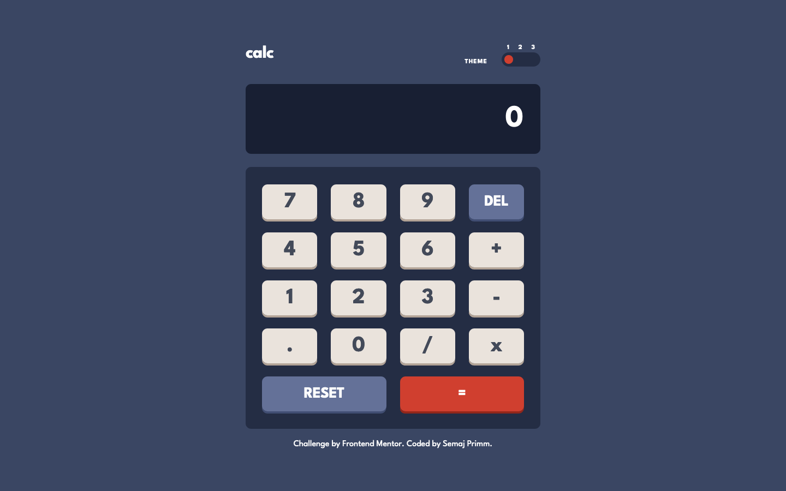
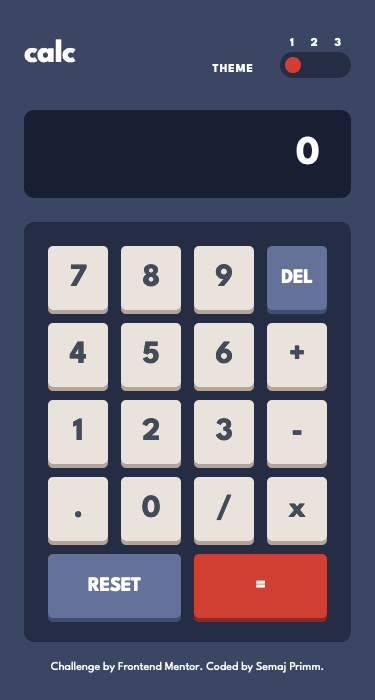
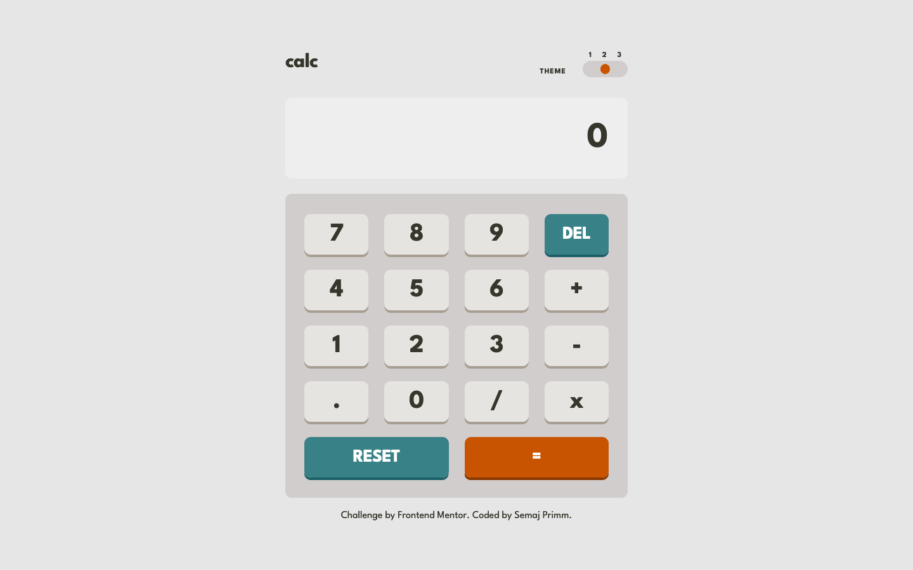
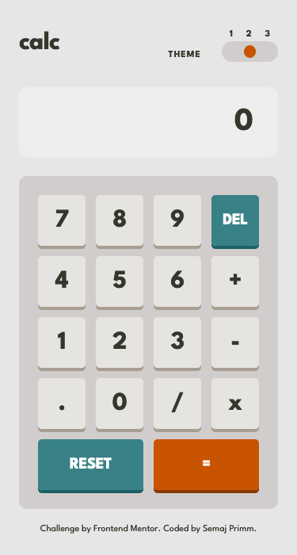
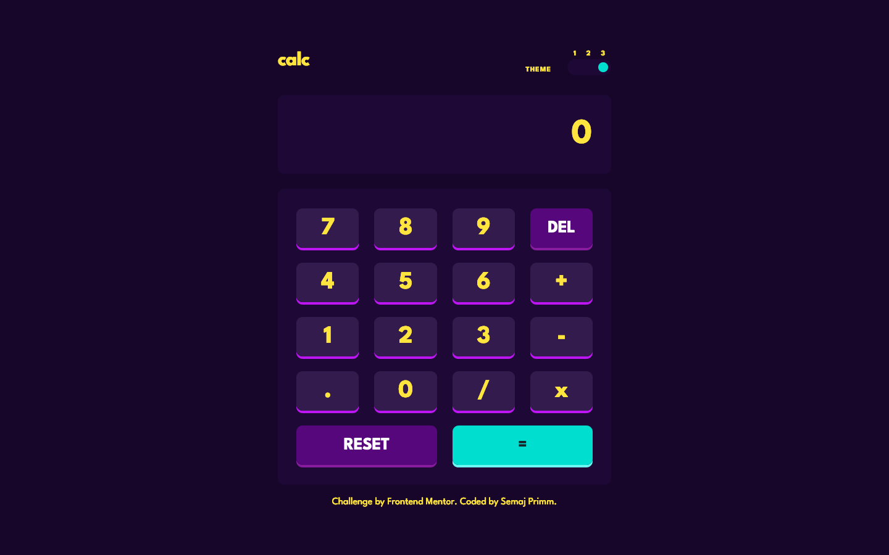
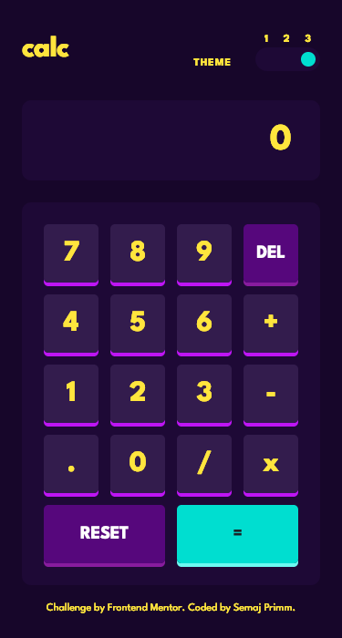

# Frontend Mentor - Calculator app solution

This is a solution to the [Calculator app challenge on Frontend Mentor](https://www.frontendmentor.io/challenges/calculator-app-9lteq5N29).

## Table of contents

- [Overview](#overview)
  - [The challenge](#the-challenge)
  - [Screenshot](#screenshot)
  - [Links](#links)
- [My process](#my-process)
  - [Built with](#built-with)
  - [What I learned](#what-i-learned)
  - [Useful resources](#useful-resources)
- [Author](#author)

## Overview

### The challenge

To build a calculator with features including:

- A three-way theme toggle button
- Perform arithmetic operations: addition, subtraction, multiplication, and division.
- Responsive design for mobile, tablet, and desktop screens

## Screenshot

### Default Theme
#### Desktop

#### Mobile

### Day Theme
#### Desktop

#### Mobile

### Neon Theme
#### Desktop

##### Mobile

### Links

- Solution URL: [github.com/semajthomasprimm/](https://github.com/semajthomasprimm/calculator-app)
- Live Site URL: [Live Demo](https://calculator-app-spr.netlify.app/)

## My process

### Built with

- [React](https://reactjs.org/) - JS library
- [TailwindCSS](https://tailwindcss.com/) - For styling
- Flexbox
- CSS Grid
- Mobile-first workflow

### What I learned

#### How to define multiple themes with TailwindCSS

This app has 3 different themes, so I immediately researched a tutorial for help with this. Thanks to the TailwindCSS YouTube channel, I was able learn how to define multiple themes.

Using CSS variables, I defined the theme in index.css and utilized the CSS variables in my Tailwind config file.

Naming the variables was difficult, I had to make sure that the class names I used in the React components weren't theme specific.

Combining the 3-way toggle, I way able to easily fix any lingering style mistakes.

#### Develop a 3-way toggle using React hooks

A 3-way toggle requires 3 states to be monitored, as opposed to a regular 2-way toggle. After researching different approaches in vanilla JS and ReactJS, I declared a state variable using useState, which would contain a Boolean array of 3 values.

The index of each Boolean value refers to a specific theme. Default is 0, Day is 1, and Neon is 2.

The default theme is true initially. When the toggle is switched, the state variable updates the array and the selected theme is conditionally rendered.

### Useful resources

- [TailwindCSS Custom Themes Tutorial](https://www.youtube.com/watch?v=MAtaT8BZEAo) - This helped me with defining multiple themes using TailwindCSS and CSS variables. I really liked this pattern and will use it going forward.
- [3 way toggle CodePen example](https://codepen.io/magnus16/pen/grzqMz) - This is a helpful vanilla JS approach to developing a 3-way toggle. I used it help model my ReactJS implementation.

## Author

- Website - [Semaj Primm](https://www.semajprimm.com)
- Frontend Mentor - [@semajthomasprimm](https://www.frontendmentor.io/profile/semajthomasprimm)
